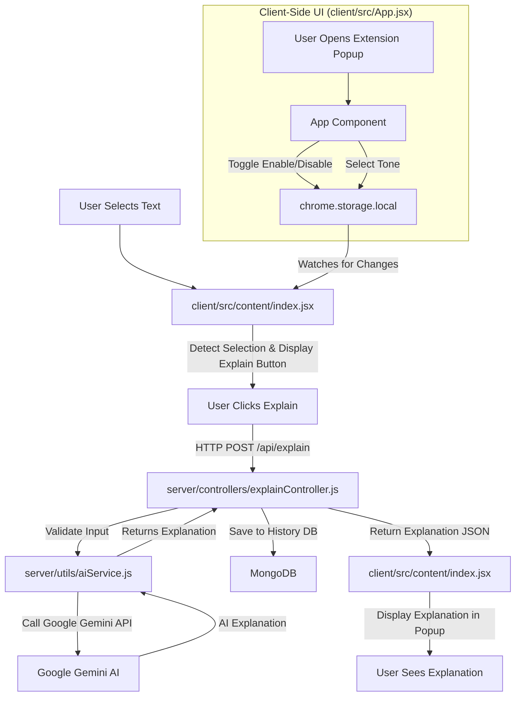

# ClariMind AI: Your Instant Web Explainer 🧠

Welcome to the ClariMind AI Master Documentation! This document provides a comprehensive overview of a powerful browser extension that brings AI-driven explanations directly to your fingertips. Simply select any text on a webpage, and ClariMind AI will instantly provide a clear, concise explanation, tailored to your preferred style.

## 🗿 IMPORTANT!!!

This README is made by my Documentaion Maker AI.
Check it Out:- https://github.com/oms13/Documentation-Maker-AI.git

## 🚀 Project Overview

ClariMind AI is an innovative browser extension designed to enhance your understanding of web content. It seamlessly integrates with your browsing experience, allowing you to select any piece of text and receive an AI-generated explanation on demand. Underpinning this user-friendly frontend is a robust backend system that handles AI interactions, persists explanation history, and ensures efficient delivery of intelligent insights.

Whether you're a student, researcher, or simply a curious mind, ClariMind AI aims to demystify complex information across the web, making learning more accessible and engaging.

## 🚀 Installation & Local Development

Follow these steps to get the development environment running:

1. Clone the repository:
```bash
git clone [https://github.com/oms13/ClariMind-AI.git](https://github.com/oms13/ClariMind-AI.git)
cd ClariMind-AI
```

2. Install dependencies:

You need to install the required packages for both the client and the server.

```bash
# Navigate to the client folder and install
cd client
npm install

# Navigate to the server folder and install
cd ../server
npm install
```

3. Run the development server:

Return to the root directory of the project. Running the dev script will simultaneously build the client's `dist` folder and start the Node.js backend using Nodemon.

```bash
cd ..
npm run dev
```

---

## 🧩 Loading the Extension in Chrome

Once your `client/dist` folder is built and the server is running, you need to load the extension into your browser:

1. Open Google Chrome and navigate to `chrome://extensions/` in your address bar.

2. Toggle the Developer mode switch in the top right corner to ON.

3. Click the Load unpacked button that appears in the top left.

4. Navigate to your project folder, select the `client/dist` directory, and click open. (This folder contains all the necessary files for the browser to run the extension).

That's it! The ClariMind AI extension is now active in your browser. Select some text on any webpage and test it out.

---

## 🛠️ Tech Stack

ClariMind AI leverages a modern and powerful set of technologies to deliver its intelligent features:

*   **Frontend (Browser Extension)**:
    *   ⚛️ **React.js**: For building a dynamic and responsive user interface for both the extension popup and the injected content script.
    *   🌐 **Chrome Extension API**: For interacting with browser functionalities like local storage, content script injection, and tab management.
*   **Backend (API Server)**:
    *   🟢 **Node.js**: The JavaScript runtime for building the scalable server-side application.
    *   🚀 **Express.js**: A fast, unopinionated, minimalist web framework for Node.js, used to create the RESTful API endpoints.
*   **Database**:
    *   🌿 **MongoDB**: A NoSQL document database used for storing persistent data, specifically the history of explanations generated.
    *   🍃 **Mongoose**: An elegant MongoDB object modeling tool for Node.js, simplifying data interaction and schema definition.
*   **Artificial Intelligence**:
    *   🧠 **Google Gemini AI API**: The cutting-edge large language model used to generate intelligent, context-aware explanations from user-selected text.

## 🏛️ Core Architecture

The ClariMind AI project follows a client-server architecture, with a browser extension acting as the client and a Node.js application serving as the backend.

1.  **Browser Extension (Client)**:
    *   The extension's **popup UI (`client/src/App.jsx`)** provides global settings, such as enabling/disabling the extension and selecting the desired explanation tone (e.g., "formal," "casual," "technical"). These settings are persistently stored in the browser's `chrome.storage.local`.
    *   A **content script (`client/src/content/index.jsx`)** is injected into every webpage. This script is responsible for:
        *   Detecting user text selections (`handleMouseUp`).
        *   Displaying an "Explain" button near the selected text.
        *   Managing the lifecycle and content of an interactive popup where explanations are displayed.
        *   Synchronizing its operational state and explanation tone with the global settings stored in `chrome.storage.local` (`handleStorageChange`).

2.  **Backend API Server (Server)**:
    *   A **Node.js/Express.js application** handles all requests for explanations and persists data.
    *   The **database connection (`server/config/db.js`)** establishes a robust link to a MongoDB instance using Mongoose.
    *   The core **explanation logic (`server/controllers/explainController.js`)** exposes an API endpoint (e.g., `/api/explain`). This endpoint receives the user's selected text and desired tone from the client.

3.  **AI Integration & Data Flow**:
    *   When the "Explain" button is clicked in the content script (`handleExplainClick`), an HTTP POST request is sent to the backend's `/api/explain` endpoint.
    *   The `explainController` validates the incoming text.
    *   It then calls the **AI service utility (`server/utils/aiService.js`)**, which acts as an interface to the Google Gemini AI API. This utility crafts a prompt using the selected text and tone, sends it to Gemini, and receives the AI-generated explanation.
    *   Crucially, before sending the explanation back to the client, the `explainController` **logs the interaction** by saving both the original selected text and the generated explanation into a `History` collection within the MongoDB database.
    *   Finally, the generated explanation is returned to the content script, which displays it within the interactive popup to the user.

This architecture ensures a clear separation of concerns, scalability for AI requests, and persistent storage of valuable explanation history.



## 📂 Primary Folders & Files Breakdown

### `client/` - The Browser Extension Frontend

This directory houses all the code for the ClariMind AI browser extension, including its popup interface and the scripts injected into web pages.

*   #### `client/src/App.jsx`
    *   **Main `App` Component**: 🏠 The central user interface for the extension's popup. It allows users to easily control the extension's core functionality:
        *   Toggle the extension **on or off**.
        *   Select their preferred **explanation style or tone** (e.g., formal, simple, technical).
        *   These settings are automatically **persisted** in `chrome.storage.local` to remember user preferences across sessions.
        *   Provides a **gateway to a dashboard** for saved explanations (currently a placeholder for future development).
    *   **`toggleExtension` Function**: 🔛 Manages the `isEnabled` state of the extension. It updates the UI and persistently saves the new state (enabled/disabled) to `chrome.storage.local` under the `clarimindEnabled` key.
    *   **`handleToneChange` Function**: 🎤 Updates the application's `tone` setting. When a user selects a new tone from the UI, this function updates the component's state and saves the new tone to `chrome.storage.local` as `clarimindTone`.
    *   **`openDashboard` Function**: 📊 A placeholder function that programmatically opens a new browser tab or window, currently navigating to `http://localhost:5000`. It serves as an architectural hook for a future dashboard feature.

*   #### `client/src/content/index.jsx`
    *   **`ContentApp` Component**: 💬 This is the heart of the on-page interaction. As a React component injected directly into web pages, it orchestrates the main Clarimind functionality:
        *   **Detects user text selections** on the page.
        *   Renders an "Explain" button near the selected text.
        *   Manages a dynamic popup to display AI-generated explanations.
        *   **Synchronizes its behavior** (enabled/disabled, explanation tone) with the settings stored in `chrome.storage.local`, ensuring a consistent experience.
    *   **`handleStorageChange` Function**: 🔄 Essential for reactivity. This function listens for changes to `clarimindEnabled` and `clarimindTone` in `chrome.storage.local`. When settings are updated (e.g., from the extension popup), it immediately reflects these changes in the content script's UI, ensuring synchronization.
    *   **`handleMouseUp` Function**: 🖱️ Triggers when a user releases the mouse button. Its primary role is to detect if text has been selected on the webpage (outside of the extension's own UI) and, if the extension is enabled, captures the selected text and its position to prompt the "Explain" button.
    *   **`handleMouseDown` Function**: 🚫 Handles global mouse-down events. It's crucial for dismissing (hiding) the "Explain" button or popup when a user clicks anywhere on the page *outside* of the extension's UI elements, maintaining a clean and unobtrusive user experience.
    *   **`handleExplainClick` Function**: ✨ The core logic for obtaining an explanation. When the "Explain" button is clicked, this asynchronous function:
        *   Hides the "Explain" button.
        *   Opens the explanation popup with a loading indicator.
        *   Initiates an **HTTP POST request** to the backend API (`http://localhost:5000/api/explain`) with the selected text and preferred tone.
        *   Updates the popup with the AI-generated explanation upon success or displays an error message if the request fails.
    *   **`closePopup` Function**: ❌ Resets the state of the explanation popup, effectively closing it and clearing its content, text, and loading status, ready for the next interaction.

### `server/` - The Backend API

This directory contains the Node.js/Express.js server responsible for processing explanation requests, interacting with the AI, and storing data.

*   #### `server/config/db.js`
    *   **`connectDB` Function**: 💾 This asynchronous function is vital for the application's data layer. It establishes and manages the connection to the **MongoDB database** using Mongoose. Upon successful connection, it logs a success message; if the connection fails, it logs the error and terminates the application, ensuring data integrity from the start.

*   #### `server/controllers/explainController.js`
    *   **`explain` Function**: 💡 This is the **primary API endpoint handler** (`/api/explain`). It acts as the orchestrator for generating explanations:
        *   Receives `text` (required) and an optional `tone` from the client.
        *   **Validates** the incoming request data.
        *   Delegates the actual AI text processing to the `generateExplain` service.
        *   **Persists** the `originalText` and the `explanation` into a `History` collection in MongoDB for auditing and future reference.
        *   Responds to the client with the generated explanation (HTTP 200) or appropriate error messages (HTTP 400 for bad requests, HTTP 500 for server errors).

*   #### `server/utils/aiService.js`
    *   **`generateExplain` Function**: 🤖 This utility function is the **direct interface to the Google Gemini AI API**.
        *   It takes the `text` to be explained and an optional `tone`.
        *   It constructs a suitable prompt for the Gemini model.
        *   It handles the API call to Gemini, securely using `process.env.GEMINI_API_KEY` for authentication.
        *   Returns the AI-generated explanation string, or `null` if any errors occur during the AI interaction (e.g., network issues, API limits). This function abstracts the complexities of AI interaction from the rest of the application.
